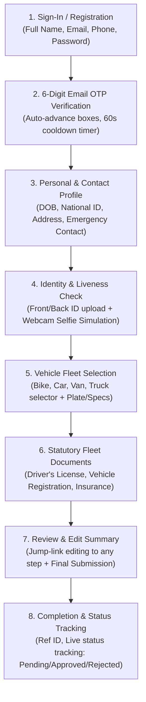

# TakeOFF Driver Onboarding Portal

A production-ready, high-conversion driver onboarding web application for **TakeOFF** courier and logistics fleet operations.

Built with **React + Vite + TypeScript + Tailwind CSS** and backed by **Supabase** (Authentication with real 6-digit email OTP, PostgreSQL relational database with Row Level Security, and Supabase Storage for document archiving).

---

## 🚀 Live Demo & Repository

- **Live URL**: [takeoff-onboarding.vercel.app](https://takeoff-onboarding.vercel.app) *(or your deployed Vercel/Netlify link)*
- **GitHub Repository**: [github.com/nigelberewere/takeoff-onboarding](https://github.com/nigelberewere/takeoff-onboarding)

---

## 🛠️ Technology Stack

| Layer | Technology | Purpose |
|---|---|---|
| **Frontend** | React 18, Vite 5, TypeScript | Blazing fast client runtime & type-safe application logic |
| **Styling** | Tailwind CSS v3 | Custom courier/logistics aesthetic (safety-amber accents & dark palette) |
| **Icons & Micro-Interactions** | Lucide React, Canvas Confetti | Visual feedback, step loaders, status indicators |
| **Authentication & OTP** | Supabase Auth (Email OTP) | Real 6-digit email OTP verification without SMS carrier fees |
| **Database** | Supabase PostgreSQL | Normalized relational tables (`drivers`, `vehicles`, `documents`) |
| **File Storage** | Supabase Storage (`driver-documents`) | Secure file archiving with Row-Level Security & direct uploads |
| **Hosting** | Vercel / Netlify | CDN-edge static hosting with single-page application rewrites |

---

## 🧭 Multi-Step Onboarding Architecture



---

## 🗄️ Supabase Database Schema (`supabase/migration.sql`)

The database is designed with a clean, normalized schema:

### 1. `public.drivers`
- `id`: UUID (Primary Key, default `gen_random_uuid()`)
- `auth_user_id`: UUID (Foreign Key references `auth.users(id)` on delete cascade, UNIQUE)
- `full_name`: Text (Driver legal name)
- `email`: Text
- `phone`: Text (Driver dispatch telephone)
- `dob`: Date (Date of birth, validated $\ge 18$)
- `national_id`: Text (National ID or passport number)
- `address`: Text (Residential street address)
- `city`: Text (Operating hub/city)
- `emergency_contact_name`: Text
- `emergency_contact_phone`: Text
- `application_status`: Enum/Text check (`draft`, `pending_review`, `approved`, `rejected`)
- `submitted_at`: Timestamptz
- `created_at`: Timestamptz

### 2. `public.vehicles`
- `id`: UUID (Primary Key)
- `driver_id`: UUID (Foreign Key references `public.drivers(id)` on delete cascade)
- `type`: Text (`bike`, `car`, `van`, `truck`)
- `make`: Text (e.g., Toyota, Isuzu)
- `model`: Text (e.g., HiAce, Fit)
- `year`: Text (e.g., 2021)
- `plate_number`: Text (e.g., TKF-8924)
- `color`: Text

### 3. `public.documents`
- `id`: UUID (Primary Key)
- `driver_id`: UUID (Foreign Key references `public.drivers(id)` on delete cascade)
- `document_type`: Text (`national_id_front`, `national_id_back`, `selfie`, `license_front`, `license_back`, `vehicle_registration`, `insurance`)
- `file_url`: Text (Direct Supabase Storage URL)
- `file_name`: Text
- `file_size`: BigInt
- `uploaded_at`: Timestamptz

### 4. Storage Bucket & Row Level Security (RLS)
- **Bucket**: `driver-documents`
- **Security**: Drivers can only view and mutate rows where `auth_user_id = auth.uid()` or where `driver_id` belongs to their authenticated user.

---

## ⚙️ Local Development Setup

### Prerequisites
- Node.js 18+
- npm or pnpm

### 1. Clone & Install Dependencies
```bash
git clone https://github.com/nigelberewere/takeoff-onboarding.git
cd takeoff-onboarding
npm install
```

### 2. Configure Environment Variables
Copy `.env.example` to `.env`:
```bash
cp .env.example .env
```
Fill in your Supabase credentials:
```env
VITE_SUPABASE_URL=https://your-project.supabase.co
VITE_SUPABASE_ANON_KEY=your-supabase-anon-key
VITE_STORAGE_BUCKET=driver-documents
```

### 3. Run the Database Migration
In your **Supabase Dashboard**:
1. Open **SQL Editor**.
2. Paste the entire content of [`supabase/migration.sql`](file:///c:/Users/Nigel/Documents/projects/takeoff%20ag/supabase/migration.sql).
3. Click **Run**. This generates the tables, indexes, RLS policies, and the `driver-documents` bucket.

### 4. Enable Email OTP in Supabase
By default, Supabase sends magic links. To enable 6-digit numerical verification codes:
1. Go to **Supabase Dashboard $\rightarrow$ Authentication $\rightarrow$ Email Templates $\rightarrow$ Confirm signup** (or **Magic Link**).
2. Ensure the template body includes:
   ```html
   <h2>Your TakeOFF Verification Code</h2>
   <p>Enter this 6-digit code to complete your driver application:</p>
   <h1 style="letter-spacing: 4px;">{{ .Token }}</h1>
   ```
3. Save changes.

### 5. Launch Development Server
```bash
npm run dev
```
Open [http://localhost:5173](http://localhost:5173) in your browser.

---

## 🔍 How to Inspect Submitted Profiles in Supabase

Examiners and evaluators can verify database persistence and uploaded media directly in the Supabase Dashboard:

1. **View Driver Records**:
   - Go to **Table Editor $\rightarrow$ `drivers`**.
   - You will see each applicant's full name, phone number, national ID, address, emergency contact, and their current `application_status` (`draft`, `pending_review`, `approved`, or `rejected`).
2. **View Registered Vehicles**:
   - Go to **Table Editor $\rightarrow$ `vehicles`**.
   - Inspect vehicle category (`van`, `bike`, `car`, `truck`), make, model, registration plate, and color.
3. **View Documents & Upload Metadata**:
   - Go to **Table Editor $\rightarrow$ `documents`**.
   - Shows rows with `document_type`, file name, size in bytes, and public/signed file URLs.
4. **View Raw Files in Storage**:
   - Go to **Storage $\rightarrow$ `driver-documents`**.
   - Documents and webcam selfie captures are archived in folders organized by user ID (`<user_id>/<doc_type>-<timestamp>-<filename>`).

---

## 🛡️ Edge Cases & Resilience

| Edge Case | Implementation |
|---|---|
| **Expired or Invalid OTP** | Real verification error returned from Supabase Auth with visual error banner and automated 60-second cooldown timer for resending code. |
| **Duplicate Email Registration** | Handled gracefully with inline error message without app crash. |
| **Camera Access Blocked** | `CameraModal` displays clear instructions and falls back seamlessly to standard file upload. |
| **Draft Persistence** | Changes autosave continuously to `localStorage` and Supabase draft records; refreshing the browser resumes where the applicant left off. |
| **Empty Required Fields** | Strict client-side validation prevents progressing past any stage with missing or invalid fields. |
| **Admin Simulation Tool** | Built-in grading drawer on the completion screen allows instant simulation of admin status changes (`pending_review` $\rightarrow$ `approved` $\rightarrow$ `rejected`) to verify real-time status badge rendering. |

---

## 🚢 Production Deployment

### Build Command
```bash
npm run build
```
Generates a zero-error optimized static bundle in the `dist/` directory.

### Deploy to Vercel
1. Import repository on [vercel.com](https://vercel.com).
2. Set Environment Variables:
   - `VITE_SUPABASE_URL`
   - `VITE_SUPABASE_ANON_KEY`
   - `VITE_STORAGE_BUCKET`
3. Deploy! `vercel.json` ensures all client-side routes rewrite to `/index.html`.

### Deploy to Netlify
1. Import repository on [netlify.com](https://netlify.com).
2. The included `netlify.toml` automatically configures publish directory (`dist`) and SPA 200 redirects.
